# 🚀 คู่มือสถาปัตยกรรม & เคล็ดลับการจัดการ Google Sheets + Drive พร้อมระบบ Progress Bar แบบ % (Production-Ready 2.0)

> **วัตถุประสงค์ของเอกสารนี้:** รวบรวมเทคนิค สถาปัตยกรรมระดับ Production และชุดโค้ดสำเร็จรูป (Zero-Dependency & Copy-Paste Ready) เพื่อนำไปประยุกต์ใช้กับโปรเจกต์ที่ใช้ Tech Stack: **Frontend (HTML5 / Vanilla JS / CSS) + Google Apps Script Web App (Backend) + Google Sheets (Database) + Google Drive (Storage)** ได้ทันทีอย่างมีเสถียรภาพ รวดเร็ว และปลอดภัยสูงสุด

---

## 📑 สารบัญ (Table of Contents)
1. [ภาพรวมสถาปัตยกรรม (Full-Stack GAS Architecture)](#1-ภาพรวมสถาปัตยกรรม-full-stack-gas-architecture)
   - 1.1 [Request-Response & Data Flow Cycle](#11-request-response--data-flow-cycle)
   - 1.2 [ไฟล์อ้างอิงหลักในโปรเจกต์](#12-ไฟล์อ้างอิงหลักในโปรเจกต์)
2. [9 เคล็ดลับขั้นเทพในการจัดการข้อมูล (Data Management Secrets)](#2-9-เคล็ดลับขั้นเทพในการจัดการข้อมูล-data-management-secrets)
   - 2.1 [ปลดล็อกปัญหา CORS 100% ด้วย Simple Request + Follow Redirect + GET Cache-Busting](#21-ปลดล็อกปัญหา-cors-100-ด้วย-simple-request--follow-redirect--get-cache-busting)
   - 2.2 [เทคนิคบีบอัดภาพหน้าบ้านด้วย HTML5 Canvas แบบ Zero-Dependency (Payload Saver)](#22-เทคนิคบีบอัดภาพหน้าบ้านด้วย-html5-canvas-แบบ-zero-dependency-payload-saver)
   - 2.3 [ทริคแยก Drive Upload ออกนอก ScriptLock + SpreadsheetApp.flush()](#23-ทริคแยก-drive-upload-ออกนอก-scriptlock--spreadsheetappflush)
   - 2.4 [การดึงภาพและเอกสารผ่าน Google Drive Thumbnail CDN URL](#24-การดึงภาพและเอกสารผ่าน-google-drive-thumbnail-cdn-url)
   - 2.5 [ระบบความปลอดภัย: Smart Formula Injection Sanitizer (ไม่ทำลายตัวเลข)](#25-ระบบความปลอดภัย-smart-formula-injection-sanitizer-ไม่ทำลายตัวเลข)
   - 2.6 [Multi-Layer Caching (Client SWR + Server ScriptCache รับมือขีดจำกัด 100KB)](#26-multi-layer-caching-client-swr--server-scriptcache-รับมือขีดจำกัด-100kb)
   - 2.7 [กฎเหล็ก Batch Operations: getValues/setValues เร็วกว่าวนลูปเซลล์ 100 เท่า](#27-กฎเหล็ก-batch-operations-getvaluessetvalues-เร็วกว่าวนลูปเซลล์-100-เท่า)
   - 2.8 [Idempotent Database Schema Setup & Auto-Migration](#28-idempotent-database-schema-setup--auto-migration)
   - 2.9 [ขีดจำกัดโควตาและเวลาทำงานของ Google Apps Script (Quotas & Timeouts)](#29-ขีดจำกัดโควตาและเวลาทำงานของ-google-apps-script-quotas--timeouts)
3. [ระบบ Progress Loading Bar แบบแสดงเปอร์เซ็นต์จริง (%)](#3-ระบบ-progress-loading-bar-แบบแสดงเปอร์เซ็นต์จริง-)
   - 3.1 [ทำไม Progress Bar แบบ % ถึงสำคัญมากกับ Google Apps Script](#31-ทำไม-progress-bar-แบบ--ถึงสำคัญมากกับ-google-apps-script)
   - 3.2 [สถาปัตยกรรม Progress 2 เลเยอร์ (Top Bar vs Modal Overlay)](#32-สถาปัตยกรรม-progress-2-เลเยอร์-top-bar-vs-modal-overlay)
   - 3.3 [อัลกอริทึม Stage-Driven + Tweening Easing + AbortController](#33-อัลกอริทึม-stage-driven--tweening-easing--abortcontroller)
   - 3.4 [ชุดโค้ดพร้อมใช้ระดับ Production (HTML5 + Modern CSS + JS Controller)](#34-ชุดโค้ดพร้อมใช้ระดับ-production-html5--modern-css--js-controller)
   - 3.5 [ตัวอย่างการผูกระบบใน Form Submission Flow แบบสมบูรณ์](#35-ตัวอย่างการผูกระบบใน-form-submission-flow-แบบสมบูรณ์)
4. [โครงสร้างโค้ด Google Apps Script แบบ Clean Modular Architecture](#4-โครงสร้างโค้ด-google-apps-script-แบบ-clean-modular-architecture)
5. [ระบบตรวจสอบและเก็บบันทึกประวัติ (Audit Logging & Telemetry)](#5-ระบบตรวจสอบและเก็บบันทึกประวัติ-audit-logging--telemetry)
6. [ตารางแก้ปัญหาเร่งด่วน (Troubleshooting Matrix: Top 10 Gotchas)](#6-ตารางแก้ปัญหาเร่งด่วน-troubleshooting-matrix-top-10-gotchas)
7. [Checklist การนำไปใช้กับโปรเจกต์ใหม่ใน 15 นาที](#7-checklist-การนำไปใช้กับโปรเจกต์ใหม่ใน-15-นาที)

---

## 1. ภาพรวมสถาปัตยกรรม (Full-Stack GAS Architecture)

### 1.1 Request-Response & Data Flow Cycle

```mermaid
sequenceDiagram
    autonumber
    actor User as ผู้ใช้งาน (Browser)
    participant Client as Frontend (HTML/JS/Canvas)
    participant Progress as Progress & Loading UI
    participant GAS as Google Apps Script Web App
    participant Drive as Google Drive Storage
    participant Sheets as Google Sheets Database

    User->>Client: กรอกฟอร์ม + เลือกไฟล์ภาพ (3-12MB)
    Client->>Progress: เริ่มแสดง Modal Progress (15%)
    Client->>Client: Canvas Resizing & WebP Encoding (ลดขนาดเหลือ ~150KB)
    Client->>Progress: อัปเดตสเต็ปที่ 2 (35%)
    
    rect rgb(30, 41, 59)
        note over Client,GAS: CORS Simple Request (text/plain) + redirect: 'follow'
        Client->>GAS: POST text/plain payload (JSON stringified)
        Client->>Progress: เริ่ม Tweening Timer จำลองสถานะ (35% -> 88%)
        
        GAS->>GAS: Router.handlePost(e) & JSON.parse
        Note over GAS,Drive: ขั้นที่ 1: อัปโหลดภาพ (ทำนอก ScriptLock ขนานได้หลายคน)
        GAS->>Drive: Drive.saveFile(base64Data)
        Drive-->>GAS: ส่งคืน fileId และ CDN Thumbnail URL
        
        Note over GAS,Sheets: ขั้นที่ 2: ล็อกคิวบันทึกข้อมูลแบบ Atomic (0.1 - 0.2 วินาที)
        GAS->>Sheets: LockService.getScriptLock().tryLock(30000)
        GAS->>Sheets: sheet.appendRow(...) + SpreadsheetApp.flush()
        GAS->>Sheets: lock.releaseLock()
    end
    
    GAS-->>Client: HTTP 200 JSON Response { success: true, data: {...} }
    Client->>Progress: ดีดตัวเลขขึ้น 100% ✅ (เสร็จสมบูรณ์)
    Progress-->>User: ปิดหน้าต่างโหลด + แสดง Toast แจ้งสำเร็จ
```



### 1.2 ไฟล์อ้างอิงหลักในโปรเจกต์

| ส่วนงาน | ไฟล์ในโปรเจกต์ปัจจุบัน | บทบาทและหน้าที่หลัก |
|---|---|---|
| **API Client** | [`js/api.js`](file:///d:/Mylove-Sutthinee/js/api.js) | จัดการคำขอ HTTP GET/POST, แยกระบบ Cache-Busting, และดักจับ Network Error |
| **Progress & UI** | [`js/loading.js`](file:///d:/Mylove-Sutthinee/js/loading.js) | จัดการ Top Progress Bar และการจำลองเปอร์เซ็นต์โหลด |
| **Modal & Alerts** | [`js/modal.js`](file:///d:/Mylove-Sutthinee/js/modal.js), [`js/toast.js`](file:///d:/Mylove-Sutthinee/js/toast.js) | แสดงผล Overlay, หน้าต่างยืนยัน, และการแจ้งเตือนสเต็ป |
| **GAS Router** | [`apps-script/Code.gs`](file:///d:/Mylove-Sutthinee/apps-script/Code.gs), [`apps-script/Router.gs`](file:///d:/Mylove-Sutthinee/apps-script/Router.gs) | จุดรับ `doGet` / `doPost` และกระจายคำขอไปยังโมดูลที่เกี่ยวข้อง |
| **Database Layer** | [`apps-script/Sheets.gs`](file:///d:/Mylove-Sutthinee/apps-script/Sheets.gs) | ห่อหุ้มคำสั่งอ่าน/เขียน Google Sheets พร้อมฟังก์ชัน Batch และ Schema Setup |
| **Storage Layer** | [`apps-script/Drive.gs`](file:///d:/Mylove-Sutthinee/apps-script/Drive.gs) | จัดการโฟลเดอร์แยกตามปีการศึกษา, ถอดรหัส Base64, และตั้งสิทธิ์ View |
| **Upload Pipeline** | [`apps-script/Upload.gs`](file:///d:/Mylove-Sutthinee/apps-script/Upload.gs) | ไปป์ไลน์บันทึกไฟล์และผูก Metadata เข้ากับฐานข้อมูล |
| **Utilities & Auth** | [`apps-script/Utils.gs`](file:///d:/Mylove-Sutthinee/apps-script/Utils.gs), [`apps-script/Auth.gs`](file:///d:/Mylove-Sutthinee/apps-script/Auth.gs) | ตัวจัดฟอร์แมต JSON, ตัวแปลง Formula Injection, และระบบแฮชรหัสผ่าน |

---

## 2. 9 เคล็ดลับขั้นเทพในการจัดการข้อมูล (Data Management Secrets)

### 2.1 ปลดล็อกปัญหา CORS 100% ด้วย Simple Request + Follow Redirect + GET Cache-Busting

#### ⚠️ ปัญหาคลาสสิกของ Google Apps Script
1. **CORS Preflight Failure:** เมื่อยิง `POST` โดยระบุ `headers: { 'Content-Type': 'application/json' }` เบราว์เซอร์จะส่งคำขอ `OPTIONS` (Preflight) ไปถามสิทธิ์เซิร์ฟเวอร์ก่อนเสมอ **แต่เซิร์ฟเวอร์ Google Apps Script ไม่ตอบสนองต่อคำขอ OPTIONS** ส่งผลให้เบราว์เซอร์บล็อกคำขอทันทีด้วยข้อผิดพลาด CORS policy
2. **Google 302 Redirect:** Google Apps Script จะ redirect ผลลัพธ์จาก `script.google.com` ไปยัง Google User Content CDN เสมอ หากไม่สั่งให้เบราว์เซอร์ติดตาม (Follow Redirect) คำขอจะขาดตอน
3. **GET Cache Trap:** เบราว์เซอร์หรือ Edge CDN ของ Google มักแคชผลลัพธ์คำขอ `GET` ไว้อย่างดุดัน ทำให้ผู้ใช้เห็นข้อมูลเก่าแม้ใน Google Sheets จะแก้ไขแล้ว

#### ✅ วิธีแก้ที่ถูกต้องและเสถียรที่สุดระดับ Production

> [!IMPORTANT]
> **กฎเหล็ก 3 ข้อ:**
> 1. ใช้ `'Content-Type': 'text/plain;charset=utf-8'` (จัดเป็น **CORS Simple Request** เบราว์เซอร์จะไม่ส่ง OPTIONS เลย)
> 2. ใส่ `redirect: 'follow'` ในตัวเลือกของ `fetch`
> 3. สำหรับคำขอ `GET` ให้ใส่พารามิเตอร์ `_t=${Date.now()}` เสมอเพื่อบังคับไม่ให้ติดแคชเบราว์เซอร์

**ตัวอย่างโค้ดฝั่งหน้าบ้าน (`api.js`):**
```javascript
export const API = {
  baseUrl: 'https://script.google.com/macros/s/YOUR_SCRIPT_ID/exec',

  // 1. คำขอแบบ GET พร้อม Cache-Busting
  async get(action, params = {}) {
    const queryParams = new URLSearchParams({
      action,
      ...params,
      _t: Date.now() // 💡 ป้องกัน Browser และ CDN แคชข้อมูลเก่า
    });

    const res = await fetch(`${this.baseUrl}?${queryParams.toString()}`, {
      method: 'GET',
      redirect: 'follow'
    });
    
    if (!res.ok) throw new Error(`HTTP error! status: ${res.status}`);
    return await res.json();
  },

  // 2. คำขอแบบ POST ด้วย Simple Request Hack
  async post(action, payload = {}) {
    const body = JSON.stringify({ action, ...payload });

    const res = await fetch(this.baseUrl, {
      method: 'POST',
      headers: {
        'Content-Type': 'text/plain;charset=utf-8' // 💡 กุญแจสำคัญ: ไม่เกิด Preflight OPTIONS
      },
      body: body,
      redirect: 'follow' // 💡 ตาม Redirect ของ Google 302 ไปยังผลลัพธ์จริง
    });

    if (!res.ok) throw new Error(`HTTP error! status: ${res.status}`);
    return await res.json();
  }
};
```

**ตัวอย่างโค้ดฝั่งหลังบ้าน Google Apps Script ([`apps-script/Code.gs`](file:///d:/Mylove-Sutthinee/apps-script/Code.gs)):**
```javascript
function doPost(e) {
  try {
    // อ่าน Plain Text แล้ว Parse เป็น JSON Object
    var contents = (e && e.postData && e.postData.contents) ? e.postData.contents : '{}';
    var payload = JSON.parse(contents);
    
    return Router.handlePost(payload);
  } catch (err) {
    return Utils.jsonError('POST_PARSE_ERROR: ' + err.message);
  }
}
```

---

### 2.2 เทคนิคบีบอัดภาพหน้าบ้านด้วย HTML5 Canvas แบบ Zero-Dependency (Payload Saver)

#### ⚠️ ปัญหา
- กล้องสมาร์ตโฟนปัจจุบันถ่ายภาพขนาด **4MB ถึง 15MB**
- Google Apps Script มีขีดจำกัดขนาด Payload ต่อคำขอไม่เกิน **50MB** แต่ความเร็วในการประมวลผลสตริง Base64 บน Cloud V8 ช้ามาก
- หากส่งภาพ 8MB เข้าไป Google Apps Script จะใช้เวลา Decode นานจนชนขีดจำกัด **Timeout 30 วินาที** ของ Web App ทันที

#### ✅ ทางออก: ย่อสเกลและบีบอัดบนเครื่อง Client ด้วย Canvas API

> [!TIP]
> การประมวลผลภาพบน Canvas ด้วย `createObjectURL` ใช้เวลาน้อยกว่า 300 มิลลิวินาที และช่วยลดขนาดไฟล์ลงได้ถึง **90% - 95%** (จาก 6MB เหลือ 120KB - 250KB) โดยที่ยังคงความคมชัดสูงสำหรับเปิดดูบนหน้าจอ

```javascript
/**
 * บีบอัดและปรับขนาดภาพแบบ Zero-Dependency บนเบราว์เซอร์
 * @param {File} file - ไฟล์ภาพที่ได้จาก <input type="file">
 * @param {Object} options - ตั้งค่า { maxWidth: 1600, maxHeight: 1200, quality: 0.82 }
 * @returns {Promise<{base64: string, mimeType: string, name: string, size: number}>}
 */
export async function compressImage(file, options = {}) {
  const maxWidth = options.maxWidth || 1600;
  const maxHeight = options.maxHeight || 1200;
  const quality = options.quality || 0.82;

  // หากไม่ใช่ไฟล์รูปภาพ ให้ปฏิเสธทันที
  if (!file.type.startsWith('image/')) {
    throw new Error('ไฟล์ที่เลือกไม่ใช่รูปภาพที่รองรับ');
  }

  return new Promise((resolve, reject) => {
    const objectUrl = URL.createObjectURL(file);
    const img = new Image();

    img.onload = () => {
      // คืนหน่วยความจำ Object URL ทันที
      URL.revokeObjectURL(objectUrl);

      let { width, height } = img;

      // คำนวณสเกลแบบรักษาสัดส่วนภาพ (Aspect Ratio)
      if (width > maxWidth || height > maxHeight) {
        const ratio = Math.min(maxWidth / width, maxHeight / height);
        width = Math.round(width * ratio);
        height = Math.round(height * ratio);
      }

      // สร้าง Off-screen Canvas
      const canvas = document.createElement('canvas');
      canvas.width = width;
      canvas.height = height;
      const ctx = canvas.getContext('2d');

      // เปิด Smoothing Algorithm คุณภาพสูง
      ctx.imageSmoothingEnabled = true;
      ctx.imageSmoothingQuality = 'high';
      ctx.drawImage(img, 0, 0, width, height);

      // ลองส่งออกเป็น WebP ก่อน (หากบราวเซอร์ไม่รองรับจะ fallback เป็น JPEG)
      let mimeType = 'image/webp';
      let dataUrl = canvas.toDataURL(mimeType, quality);

      if (!dataUrl.startsWith('data:image/webp')) {
        mimeType = 'image/jpeg';
        dataUrl = canvas.toDataURL(mimeType, quality);
      }

      // แยกส่วน Base64 บริสุทธิ์ออกจาก Header Data-URI
      const base64Data = dataUrl.split(',')[1];
      const cleanName = file.name.replace(/\.[^/.]+$/, '') + (mimeType === 'image/webp' ? '.webp' : '.jpg');

      resolve({
        base64: base64Data,
        mimeType: mimeType,
        name: cleanName,
        width: width,
        height: height
      });
    };

    img.onerror = (err) => {
      URL.revokeObjectURL(objectUrl);
      reject(new Error('ไม่สามารถเปิดและประมวลผลไฟล์ภาพได้: ' + err.message));
    };

    img.src = objectUrl;
  });
}
```

---

### 2.3 ทริคแยก Drive Upload ออกนอก ScriptLock + SpreadsheetApp.flush()

นี่คือหนึ่งในจุดตายที่ทำให้ระบบ Google Apps Script ล่มเมื่อมีคนส่งงานพร้อมกันจำนวนมาก:

```
❌ ข้อผิดพลาดที่พบบ่อย (ระบบค้างและเกิด Timeout เมื่อมีผู้ใช้พร้อมกัน):
   var lock = LockService.getScriptLock();
   lock.waitLock(30000);
   DriveApp.createFile();        <--- ใช้เวลา 3-8 วินาที!! บล็อกคิวคนอื่นทั้งหมดจนหลุด Timeout
   sheet.appendRow([...]);
   lock.releaseLock();           <--- ไม่มี SpreadsheetApp.flush() ข้อมูลจะถูกเขียนหลังปลดล็อก!
```

```
✅ สถาปัตยกรรมระดับ Production (ขนานได้สูง + ปลอดภัย 100%):
   1. อัปโหลดรูปขึ้น Google Drive ก่อนทันที (ทำนอก Lock -> ทุกคนอัปโหลดพร้อมกันได้)
   2. เรียก ScriptLock เฉพาะตอน appendRow ลง Google Sheets (ใช้เวลาเพียง 0.1 วินาที)
   3. เรียก SpreadsheetApp.flush() ทันทีเพื่อให้ Google Sheets บันทึกแถวจริงลงดิสก์ก่อนปลดล็อก!
   4. ปลดล็อกใน finally block เสมอ
   5. Orphan Rollback Pattern: หากการเขียน Sheet ล้มเหลว ให้สั่งลบไฟล์ที่เพิ่งสร้างใน Drive ทิ้งทันที!
```

**โค้ดตัวอย่างใน Apps Script ([`apps-script/Upload.gs`](file:///d:/Mylove-Sutthinee/apps-script/Upload.gs)):**
```javascript
function uploadAndRecordSubmission(payload) {
  var uploadedFileId = null;

  try {
    // -------------------------------------------------------------
    // ขั้นตอนที่ 1: บันทึกไฟล์ลง Google Drive (ทำนอก Lock ขนานได้เต็มที่)
    // -------------------------------------------------------------
    var driveRes = Drive.saveFile({
      name: payload.fileName,
      mimeType: payload.mimeType,
      base64Data: payload.base64Data,
      year: payload.year || '2567',
      subfolder: 'EVIDENCE'
    });
    uploadedFileId = driveRes.fileId;

    // -------------------------------------------------------------
    // ขั้นตอนที่ 2: ล็อกเฉพาะช่วงเขียนแถวลง Google Sheets (Atomic)
    // -------------------------------------------------------------
    var lock = LockService.getScriptLock();
    var hasLock = lock.tryLock(30000); // รอคิวสูงสุด 30 วินาที

    if (!hasLock) {
      throw new Error('เซิร์ฟเวอร์กำลังให้บริการผู้ใช้อื่นอยู่ กรุณารอสักครู่แล้วลองใหม่อีกครั้ง');
    }

    try {
      var sheet = Sheets.getSheet('PA_ITEMS');
      var newRecord = {
        id: Utils.generateId('item'),
        title: Utils.sanitizeForSheet(payload.title),
        year: payload.year,
        drive_file_id: driveRes.fileId,
        external_url: driveRes.url,
        created_at: new Date().toISOString()
      };

      Sheets.appendRow('PA_ITEMS', newRecord);

      // 💡 จุดสำคัญระดับโลก: บังคับให้ Google Sheets คอมมิตข้อมูลลงชีตจริงก่อนปล่อยล็อก!
      SpreadsheetApp.flush();

      return {
        success: true,
        data: newRecord
      };
    } finally {
      lock.releaseLock(); // ปลดล็อกทันทีเพื่อให้คิวถัดไปทำงาน
    }

  } catch (err) {
    // 💡 Orphan Rollback: ลบไฟล์ขยะใน Drive ทิ้งทันทีหากเขียน Sheet ไม่สำเร็จ
    if (uploadedFileId) {
      try {
        DriveApp.getFileById(uploadedFileId).setTrashed(true);
      } catch (rollbackErr) {
        console.error('Failed to rollback uploaded file:', rollbackErr);
      }
    }
    throw err;
  }
}
```

---

### 2.4 การดึงภาพและเอกสารผ่าน Google Drive Thumbnail CDN URL

#### ⚠️ ปัญหา
- การใช้ `https://drive.google.com/uc?id=FILE_ID` มักเจอหน้าขาว, ถูกจำกัด Bandwidth Quota หรือบล็อกการฝังจากเว็บภายนอก (Broken Image)
- การฝังผ่าน `iframe` พรีวิวโหลดช้ามาก (3-5 วินาทีต่อรูป) และกินทรัพยากรสูง

#### ✅ ทางออก: ใช้ URL ฟอร์แมต Google Drive Thumbnail CDN
ใน [`apps-script/Drive.gs`](file:///d:/Mylove-Sutthinee/apps-script/Drive.gs):

```javascript
// ความละเอียดสูงสำหรับภาพหน้าปก / แกลเลอรี (ความกว้างสูงสุด 1600px)
var cdnImageUrl = 'https://drive.google.com/thumbnail?id=' + fileId + '&sz=w1600';

// หรือสำหรับรูปขนาดเล็กในการ์ดรายการ (โหลดเร็วพิเศษ w600)
var cardThumbnailUrl = 'https://drive.google.com/thumbnail?id=' + fileId + '&sz=w600';

// สำหรับพรีวิวเอกสาร PDF หรือไฟล์ทั่วไป
var previewUrl = 'https://drive.google.com/file/d/' + fileId + '/preview';
```

> [!IMPORTANT]
> ไฟล์ใน Google Drive จะต้องถูกตั้งสิทธิ์การเข้าถึงเป็นสาธารณะสำหรับผู้มีลิงก์:
> `file.setSharing(DriveApp.Access.ANYONE_WITH_LINK, DriveApp.Permission.VIEW);`
> มิฉะนั้นเซิร์ฟเวอร์ CDN จะตอบกลับด้วยรหัส 403 / 404

---

### 2.5 ระบบความปลอดภัย: Smart Formula Injection Sanitizer (ไม่ทำลายตัวเลข)

#### ⚠️ ภัยคุกคาม (CSV / Spreadsheet Formula Injection)
หากมีผู้ไม่ประสงค์ดีหรือผู้ใช้ทั่วไปป้อนข้อความขึ้นต้นด้วย `=`, `+`, `-`, `@` เช่น `=cmd|' /C calc'!A0` หรือสูตรดึงข้อมูลภายนอก ข้อมูลดังกล่าวจะถูกรันเป็นโค้ดสั่งการเมื่อผู้ดูแลระบบเปิดไฟล์ใน Google Sheets หรือส่งออกเป็น CSV ใน Microsoft Excel

#### ❌ ข้อผิดพลาดของตัว Sanitizer ทั่วไป
ตัว Sanitizer ทั่วไปมักสั่งเติม `'` นำหน้าสตริงใดๆ ที่ขึ้นต้นด้วย `-` หรือ `+` ส่งผลให้ตัวเลขจริง เช่น `-25.50`, `+66812345678` กลายเป็นข้อความสตริง `'-25.50` ทำให้สูตรคำนวณคะแนนรวม หรือตัวเลขในชีตเกิดข้อผิดพลาด

#### ✅ Smart Formula Sanitizer ที่ถูกต้องในโปรเจกต์นี้ ([`apps-script/Utils.gs`](file:///d:/Mylove-Sutthinee/apps-script/Utils.gs)):

```javascript
/**
 * ป้องกัน Formula Injection โดยไม่ทำลายข้อมูลประเภทตัวเลขหรือบูลีน
 * @param {*} value - ข้อมูลที่ต้องการเขียนลงชีต
 * @returns {*} ข้อมูลที่ปลอดภัย
 */
function sanitizeForSheet(value) {
  if (value === null || value === undefined) return '';

  // หากเป็นตัวเลขแท้จริง ไม่ต้อง sanitize ปล่อยให้คงความเป็น Number
  if (typeof value === 'number') return value;
  if (typeof value === 'boolean') return value;

  var str = String(value).trim();
  if (str.length === 0) return '';

  var firstChar = str.charAt(0);

  // ตรวจสอบเครื่องหมายเริ่มต้นที่อาจเป็นสูตร
  if (firstChar === '=' || firstChar === '+' || firstChar === '-' || firstChar === '@' || firstChar === '\t' || firstChar === '\r') {
    // 💡 ข้อยกเว้น: หากเป็นตัวเลขติดลบหรือเครื่องหมายบวกนำหน้าตัวเลข (เช่น -15 หรือ +20)
    // ให้ถือว่าเป็นตัวเลขที่ถูกต้อง ไม่ต้องใส่ Single Quote
    if ((firstChar === '-' || firstChar === '+') && !isNaN(Number(str))) {
      return Number(str);
    }

    // กรณีเป็นข้อความสูตร ให้เติมเครื่องหมาย Single Quote นำหน้าเพื่อบังคับเป็น Pure Text
    return "'" + str;
  }

  return str;
}
```

---

### 2.6 Multi-Layer Caching (Client SWR + Server ScriptCache รับมือขีดจำกัด 100KB)

เพื่อให้ระบบทำงานได้เร็วระดับ Instant (ไม่ถึง 100ms) แม้ Google Apps Script จะมีภาวะ Cold Start:

```
[ ชั้นที่ 1: Client-Side SWR (Stale-While-Revalidate) ]
  └── ดึงข้อมูลแคชจาก localStorage มาเรนเดอร์ UI ทันทีใน 0.05 วินาที
  └── ยิง Background Fetch ไปอัปเดตข้อมูลล่าสุดแบบเงียบๆ

[ ชั้นที่ 2: Server-Side Cache (CacheService.getScriptCache()) ]
  └── ลดการอ่าน Google Sheets ซ้ำๆ ช่วยประหยัด Quota และเวลาทำงาน
  └── ⚠️ มีข้อจำกัดขนาดข้อมูลสูงสุด 100KB ต่อ Cache Entry
```

#### ✅ วิธีรับมือกับข้อจำกัด 100KB ของ `CacheService` ใน Apps Script:

```javascript
var Cache = {
  // บันทึกข้อมูลลง Cache พร้อมตรวจสอบขนาดป้องกัน Error 100KB
  set: function(key, data, expirationInSeconds) {
    try {
      var cache = CacheService.getScriptCache();
      var jsonString = JSON.stringify(data);

      // ตรวจสอบขนาดไบต์ (100KB = 102,400 bytes) เผื่อ Safety Margin ไว้ที่ 90KB
      if (jsonString.length > 90000) {
        console.warn('Cache entry too large for key: ' + key + ' (' + jsonString.length + ' bytes). Skipping cache.');
        return false;
      }

      cache.put(key, jsonString, expirationInSeconds || 300); // ค่าเริ่มต้น 5 นาที
      return true;
    } catch (e) {
      console.warn('Cache put error:', e);
      return false;
    }
  },

  get: function(key) {
    try {
      var cache = CacheService.getScriptCache();
      var cached = cache.get(key);
      return cached ? JSON.parse(cached) : null;
    } catch (e) {
      return null;
    }
  },

  remove: function(key) {
    try {
      CacheService.getScriptCache().remove(key);
    } catch (e) {}
  }
};
```

---

### 2.7 กฎเหล็ก Batch Operations: getValues/setValues เร็วกว่าวนลูปเซลล์ 100 เท่า

> [!CAUTION]
> **ห้ามเรียกใช้ `getValue()` หรือ `setValue()` ภายในลูปเด็ดขาด!**
> ทุกครั้งที่เรียก `getRange().getValue()` Google Apps Script จะต้องส่งคำขอผ่านเครือข่ายไปยังเซิร์ฟเวอร์ Spreadsheet หากวนลูป 100 แถว ระบบจะใช้เวลานานถึง **15 - 20 วินาที** จนติด Timeout

#### ✅ เปรียบเทียบประสิทธิภาพ:
```javascript
// ❌ ช้ามาก (ใช้เวลา 18.5 วินาที สำหรับ 100 แถว):
for (var i = 1; i <= 100; i++) {
  var val = sheet.getRange(i, 1).getValue();
  sheet.getRange(i, 2).setValue(val * 2);
}

// ✅ เร็วที่สุดระดับ Production (ใช้เวลา 0.12 วินาที สำหรับ 100 แถว):
var range = sheet.getRange(1, 1, 100, 2);
var values = range.getValues(); // ดึงก้อนข้อมูล 2 มิติมาไว้ใน Memory ครั้งเดียว

for (var i = 0; i < values.length; i++) {
  values[i][1] = values[i][0] * 2; // คำนวณใน RAM ของ V8 Engine
}

range.setValues(values); // บันทึกกลับลงชีตครั้งเดียวจบ!
```

---

### 2.8 Idempotent Database Schema Setup & Auto-Migration

ในการใช้งานจริง เมื่อต้องติดตั้งระบบใน Spreadsheet ใหม่ หรืออัปเดตเวอร์ชัน ระบบควรมีฟังก์ชัน `setupDatabase()` ที่เป็นแบบ **Idempotent** (รันกี่ครั้งผลลัพธ์ก็ถูกต้อง ไม่ทำลายข้อมูลเดิม และสร้างสิ่งที่ยังขาดให้อัตโนมัติ)

ดูตัวอย่างฟังก์ชันจริงใน [`apps-script/Code.gs:25-72`](file:///d:/Mylove-Sutthinee/apps-script/Code.gs#L25-L72):
1. ตรวจสอบว่ามีแท็บที่ต้องการหรือไม่ หากไม่มีให้สั่ง `insertSheet`
2. ตรวจสอบจำนวนแถว `getLastRow() === 0` เพื่อสร้างส่วนหัว (Headers) เฉพาะแท็บที่เพิ่งสร้างใหม่
3. กำหนดข้อมูลตั้งต้น (Seeding) เช่น ปีการศึกษาปัจจุบัน การตั้งค่าเว็บไซต์
4. ทำการ Freeze แถวที่ 1 และปรับแต่งสีพื้นหลัง Header อัตโนมัติ

---

### 2.9 ขีดจำกัดโควตาและเวลาทำงานของ Google Apps Script (Quotas & Timeouts)

เพื่อให้สถาปัตยกรรมของคุณทนทานต่อข้อจำกัดของ Google Cloud:

| ขีดจำกัด (Quotas) | บัญชีฟรี (@gmail.com) | บัญชีองค์กร / Workspace | แนวทางป้องกันปัญหา |
|---|---|---|---|
| **Web App Execution Timeout** | **30 วินาที / คำขอ** | **30 วินาที / คำขอ** | บีบอัดภาพหน้าบ้าน, แยกอัปโหลดนอก Lock |
| **Trigger / Background Script** | 6 นาที / การรัน | 6 นาที / การรัน | ใช้การแบ่ง Batch หากต้องประมวลผลใหญ่ |
| **Email Recipients (GmailApp)** | 100 คน / วัน | 1,500 คน / วัน | ส่งเฉพาะอีเมลสรุปที่สำคัญ |
| **URL Fetch Calls** | 20,000 ครั้ง / วัน | 100,000 ครั้ง / วัน | ใช้ ScriptCache และ LocalStorage SWR |
| **CacheService Entry Size** | 100 KB / คีย์ | 100 KB / คีย์ | จำกัดข้อมูลเฉพาะ Summary หรือแบ่ง Chunk |
| **Simultaneous Executions** | 30 concurrent | 30 concurrent | ล็อกเฉพาะแถวที่จำเป็น และปล่อยทันที |

---

## 3. ระบบ Progress Loading Bar แบบแสดงเปอร์เซ็นต์จริง (%)

### 3.1 ทำไม Progress Bar แบบ % ถึงสำคัญมากกับ Google Apps Script

- Google Apps Script มีเวลาตอบสนองตามธรรมชาติประมาณ **2.5 ถึง 5 วินาที** (Cold Start Cloud Container + Google Handshake + Sheets I/O)
- หากแสดงเพียง Spinner หมุนวนธรรมดา ผู้ใช้งานจะไม่แน่ใจว่าระบบค้างหรือไม่ และมักกดปุ่มบันทึกซ้ำๆ หรือกดรีเฟรชหน้าเว็บ (F5) ซึ่งทำให้เกิดข้อมูลซ้ำซ้อนหรือไฟล์เสีย
- **เมื่อมีตัวเลข % ขนาดใหญ่และ Stepper Checklist:**
  - ผู้ใช้งานรู้สึกสบายใจและยอมรอได้นานขึ้นถึง **30 วินาที** โดยไม่หงุดหงิด
  - มีข้อความแจ้งเตือนที่ชัดเจนว่ากำลังทำงานในขั้นตอนใด

---

### 3.2 สถาปัตยกรรม Progress 2 เลเยอร์ (Top Bar vs Modal Overlay)

| ระดับ | โมดูลในระบบ | Use Case | พฤติกรรม UI |
|---|---|---|---|
| **1. Global Top Bar** | [`js/loading.js`](file:///d:/Mylove-Sutthinee/js/loading.js) | การโหลดข้อมูลทั่วไป (GET), การสลับหน้า, การเปลี่ยนแท็บ | แถบสีวิ่งขอบบนสุดของจอ (Trickle Progress) แบบ YouTube / GitHub |
| **2. Modal Overlay Stepper** | `SubmissionProgress` | การส่งฟอร์มข้อมูลพร้อมอัปโหลดไฟล์ภาพ / เอกสาร | หน้าต่างกึ่งกลางจอ บังพื้นหลังด้วย Glassmorphism + จรวด Pulse + ตัวเลข % + 5 สเต็ป |

---

### 3.3 อัลกอริทึม Stage-Driven + Tweening Easing + AbortController

เนื่องจากการส่งคำขอผ่าน Google Redirect ไม่รองรับ `ProgressEvent.loaded` ในระดับ Byte เราจึงใช้เทคนิค **Stage-Driven Simulation พร้อมการขยับตัวเลขแบบนุ่มนวล (Tweening)**:

```
[ Stage 1: Validation ] (0% ──► 15%)
    └── ตรวจสอบความถูกต้องของ Input ในฟอร์ม (เสร็จทันที 50ms)
[ Stage 2: Canvas Processing ] (15% ──► 35%)
    └── ลดขนาดภาพและแปลง WebP (ใช้เวลา 200 - 300ms)
[ Stage 3: Network Transmission & Drive Upload ] (35% ──► 65%)
    └── ส่งข้อมูลไปยัง Apps Script + เขียนไฟล์ลง Drive
[ Stage 4: Atomic Sheet Record ] (65% ──► 88%)
    └── Google Sheets ล็อกคิวและ appendRow (ปล่อย Timer ไหลนุ่มนวล 66%..75%..88%)
[ Stage 5: Completion ] (88% ──► 100%)
    └── เซิร์ฟเวอร์ส่งรหัสสำเร็จ 200 OK -> ดีดขึ้น 100% ทันที -> สเต็ปเป็นเครื่องหมายถูก ✅ -> ปิด Overlay
```

นอกจากนี้ เพื่อป้องกันกรณีอินเทอร์เน็ตหลุดกลางคัน เราจะเพิ่ม **`AbortController` กำหนดเวลา Timeout สูงสุด 45 วินาที** หากเซิร์ฟเวอร์ไม่ตอบสนองจะตัดการทำงานและแจ้งผู้ใช้ให้ลองใหม่ทันที ไม่ค้างตลอดกาล

---

### 3.4 ชุดโค้ดพร้อมใช้ระดับ Production (HTML5 + Modern CSS + JS Controller)

#### 1) HTML Component (วางใน `<body>` ของหน้าเว็บ)
```html
<!-- Submission Progress Overlay Component -->
<div id="submissionProgressOverlay" class="sub-progress-overlay hidden" role="dialog" aria-modal="true" aria-labelledby="subProgressTitle">
  <div class="sub-progress-card">
    
    <!-- Pulse Icon Header -->
    <div class="sub-progress-icon-wrap">
      <span class="sub-progress-icon">🚀</span>
      <div class="sub-progress-ring"></div>
    </div>

    <h3 id="subProgressTitle" class="sub-progress-title">กำลังนำส่งข้อมูลเข้าสู่ระบบ</h3>
    <p id="subProgressSubtitle" class="sub-progress-subtitle">ระบบกำลังเตรียมส่งไฟล์ขึ้น Google Cloud...</p>

    <!-- Percentage Display -->
    <div class="sub-progress-percent-box">
      <span id="subProgressNumber" class="sub-progress-number">0</span>
      <span class="sub-progress-unit">%</span>
    </div>

    <!-- Progress Track & Bar -->
    <div class="sub-progress-track">
      <div id="subProgressBarFill" class="sub-progress-fill" style="width: 0%;"></div>
    </div>

    <!-- 5-Step Stepper Checklist -->
    <div class="sub-progress-steps">
      <div class="sub-step-item" id="subStep1">
        <span class="sub-step-icon">📋</span>
        <span class="sub-step-text">1. ตรวจสอบข้อมูลในแบบฟอร์ม</span>
        <span class="sub-step-badge">⏳</span>
      </div>
      <div class="sub-step-item" id="subStep2">
        <span class="sub-step-icon">🖼️</span>
        <span class="sub-step-text">2. ประมวลผลและลดขนาดรูปภาพ</span>
        <span class="sub-step-badge">⏳</span>
      </div>
      <div class="sub-step-item" id="subStep3">
        <span class="sub-step-icon">☁️</span>
        <span class="sub-step-text">3. อัปโหลดไฟล์ขึ้น Google Drive</span>
        <span class="sub-step-badge">⏳</span>
      </div>
      <div class="sub-step-item" id="subStep4">
        <span class="sub-step-icon">📊</span>
        <span class="sub-step-text">4. บันทึกข้อมูลลง Google Sheets</span>
        <span class="sub-step-badge">⏳</span>
      </div>
      <div class="sub-step-item" id="subStep5">
        <span class="sub-step-icon">✨</span>
        <span class="sub-step-text">5. ตรวจสอบความสมบูรณ์และเสร็จสิ้น</span>
        <span class="sub-step-badge">⏳</span>
      </div>
    </div>

    <!-- Safety Warning Banner -->
    <div class="sub-progress-warning">
      <span class="sub-warning-icon">⚠️</span>
      <div class="sub-warning-desc">
        <strong>กรุณารอสักครู่ ห้ามปิดหน้าต่างหรือกดรีเฟรช (F5)</strong><br>
        ระบบกำลังเชื่อมต่อ Google Drive และ Sheets เพื่อความสมบูรณ์ของข้อมูล
      </div>
    </div>

    <!-- Error Box with Retry Option -->
    <div id="subProgressError" class="sub-progress-error hidden">
      <p id="subProgressErrorMsg" class="sub-error-text"></p>
      <button type="button" id="subProgressRetryBtn" class="btn-sub-retry">ลองใหม่อีกครั้ง</button>
    </div>

  </div>
</div>
```

---

#### 2) Modern Glassmorphism CSS (บรรจุในไฟล์ Stylesheet ของคุณ)
```css
/* Glassmorphism Backdrop Overlay */
.sub-progress-overlay {
  position: fixed;
  inset: 0;
  background: rgba(15, 23, 42, 0.82);
  backdrop-filter: blur(10px);
  -webkit-backdrop-filter: blur(10px);
  z-index: 10000;
  display: flex;
  align-items: center;
  justify-content: center;
  padding: 1.25rem;
  transition: opacity 0.3s ease, visibility 0.3s ease;
}

.sub-progress-overlay.hidden {
  opacity: 0;
  visibility: hidden;
  pointer-events: none;
}

/* Modal Card */
.sub-progress-card {
  background: #1e293b;
  border: 1px solid rgba(255, 255, 255, 0.12);
  border-radius: 1.5rem;
  padding: 2.25rem 2rem;
  max-width: 480px;
  width: 100%;
  text-align: center;
  color: #f8fafc;
  box-shadow: 0 25px 50px -12px rgba(0, 0, 0, 0.5), 0 0 40px rgba(56, 189, 248, 0.15);
  animation: subCardPop 0.3s cubic-bezier(0.16, 1, 0.3, 1);
}

@keyframes subCardPop {
  0% { transform: scale(0.92); opacity: 0; }
  100% { transform: scale(1); opacity: 1; }
}

/* Header Icon Pulse */
.sub-progress-icon-wrap {
  position: relative;
  width: 68px;
  height: 68px;
  margin: 0 auto 1.25rem;
  display: flex;
  align-items: center;
  justify-content: center;
  font-size: 2.25rem;
  background: rgba(56, 189, 248, 0.1);
  border-radius: 50%;
  border: 1px solid rgba(56, 189, 248, 0.25);
  animation: subIconFloat 2.5s ease-in-out infinite;
}

@keyframes subIconFloat {
  0%, 100% { transform: translateY(0); }
  50% { transform: translateY(-8px); }
}

.sub-progress-ring {
  position: absolute;
  inset: -6px;
  border: 2px dashed rgba(56, 189, 248, 0.4);
  border-radius: 50%;
  animation: subRingSpin 10s linear infinite;
}

@keyframes subRingSpin {
  100% { transform: rotate(360deg); }
}

/* Typography */
.sub-progress-title {
  font-size: 1.35rem;
  font-weight: 700;
  margin: 0 0 0.5rem;
  color: #ffffff;
}

.sub-progress-subtitle {
  font-size: 0.9rem;
  color: #94a3b8;
  margin: 0 0 1.25rem;
  min-height: 1.4rem;
}

/* Big Percentage Number */
.sub-progress-percent-box {
  display: flex;
  align-items: baseline;
  justify-content: center;
  margin-bottom: 1.25rem;
  font-family: ui-monospace, SFMono-Regular, Menlo, Monaco, Consolas, monospace;
}

.sub-progress-number {
  font-size: 3.5rem;
  font-weight: 800;
  line-height: 1;
  background: linear-gradient(135deg, #38bdf8 0%, #818cf8 50%, #c084fc 100%);
  -webkit-background-clip: text;
  -webkit-text-fill-color: transparent;
}

.sub-progress-unit {
  font-size: 1.5rem;
  font-weight: 700;
  color: #94a3b8;
  margin-left: 0.25rem;
}

/* Progress Track & Fill */
.sub-progress-track {
  width: 100%;
  height: 12px;
  background: #0f172a;
  border-radius: 9999px;
  overflow: hidden;
  border: 1px solid rgba(255, 255, 255, 0.08);
  margin-bottom: 1.5rem;
  position: relative;
}

.sub-progress-fill {
  height: 100%;
  border-radius: 9999px;
  background: linear-gradient(90deg, #38bdf8, #818cf8, #c084fc);
  background-size: 200% 100%;
  transition: width 0.25s ease;
  position: relative;
}

/* Checklist Steps */
.sub-progress-steps {
  text-align: left;
  background: #0f172a;
  border: 1px solid rgba(255, 255, 255, 0.06);
  border-radius: 1rem;
  padding: 1.1rem;
  margin-bottom: 1.25rem;
  display: flex;
  flex-direction: column;
  gap: 0.65rem;
}

.sub-step-item {
  display: flex;
  align-items: center;
  font-size: 0.875rem;
  color: #64748b;
  transition: all 0.25s ease;
}

.sub-step-item.is-active {
  color: #38bdf8;
  font-weight: 600;
  transform: translateX(4px);
}

.sub-step-item.is-completed {
  color: #4ade80;
}

.sub-step-icon { margin-right: 0.65rem; }
.sub-step-text { flex: 1; }
.sub-step-badge { font-size: 0.95rem; }

/* Warning Banner */
.sub-progress-warning {
  background: rgba(234, 179, 8, 0.1);
  border: 1px solid rgba(234, 179, 8, 0.25);
  border-radius: 0.75rem;
  padding: 0.85rem 1rem;
  display: flex;
  align-items: center;
  gap: 0.85rem;
  text-align: left;
  font-size: 0.8rem;
  color: #fde047;
  line-height: 1.4;
}

.sub-warning-icon { font-size: 1.35rem; flex-shrink: 0; }

/* Error Box */
.sub-progress-error {
  margin-top: 1.25rem;
  background: rgba(239, 68, 68, 0.15);
  border: 1px solid rgba(239, 68, 68, 0.35);
  padding: 1.1rem;
  border-radius: 0.75rem;
  text-align: center;
}

.sub-error-text {
  color: #fca5a5;
  font-size: 0.875rem;
  margin: 0 0 0.85rem;
}

.btn-sub-retry {
  background: #ef4444;
  color: #ffffff;
  border: none;
  padding: 0.5rem 1.25rem;
  border-radius: 0.5rem;
  font-weight: 600;
  cursor: pointer;
  transition: background 0.2s;
}

.btn-sub-retry:hover { background: #dc2626; }
```

---

#### 3) Unified JavaScript Controller (`submission-progress.js`)

```javascript
/**
 * Unified Submission Progress Controller
 * จัดการเปอร์เซ็นต์และการเคลื่อนไหวแบบ Smooth Tweening พร้อมระบบ Timeout
 */
export const SubmissionProgress = {
  elements: {},
  currentPercent: 0,
  tweenInterval: null,

  init() {
    this.elements = {
      overlay: document.getElementById('submissionProgressOverlay'),
      title: document.getElementById('subProgressTitle'),
      subtitle: document.getElementById('subProgressSubtitle'),
      percentNumber: document.getElementById('subProgressNumber'),
      barFill: document.getElementById('subProgressBarFill'),
      errorBox: document.getElementById('subProgressError'),
      errorMsg: document.getElementById('subProgressErrorMsg'),
      retryBtn: document.getElementById('subProgressRetryBtn')
    };
  },

  start() {
    if (!this.elements.overlay) this.init();
    if (!this.elements.overlay) return;

    this.stopTween();
    this.currentPercent = 0;
    this.updateBar(5);
    this.elements.overlay.classList.remove('hidden');
    if (this.elements.errorBox) this.elements.errorBox.classList.add('hidden');

    // รีเซ็ตสเต็ปทั้ง 5 รายการเป็นนาฬิกาทราย ⏳
    for (let i = 1; i <= 5; i++) {
      const step = document.getElementById('subStep' + i);
      if (step) {
        step.className = 'sub-step-item';
        const badge = step.querySelector('.sub-step-badge');
        if (badge) badge.textContent = '⏳';
      }
    }

    this.setStep(1, 15, 'กำลังตรวจสอบความถูกต้องของข้อมูล...');
  },

  setStep(stepIndex, targetPercent, text) {
    if (this.elements.subtitle && text) {
      this.elements.subtitle.textContent = text;
    }

    // ขยับเปอร์เซ็นต์ไปยังเป้าหมาย
    this.animateTo(targetPercent);

    // อัปเดตสถานะสเต็ปใน Checklist
    for (let i = 1; i <= 5; i++) {
      const step = document.getElementById('subStep' + i);
      if (!step) continue;
      const badge = step.querySelector('.sub-step-badge');

      if (i < stepIndex) {
        step.className = 'sub-step-item is-completed';
        if (badge) badge.textContent = '✅';
      } else if (i === stepIndex) {
        step.className = 'sub-step-item is-active';
        if (badge) badge.textContent = '🔄';
      } else {
        step.className = 'sub-step-item';
        if (badge) badge.textContent = '⏳';
      }
    }
  },

  /**
   * จำลองเปอร์เซ็นต์ให้ไหลไปเรื่อยๆ ระหว่างรอ Network หรือ Google Apps Script
   */
  simulateProgress(targetPercent = 88, intervalMs = 250) {
    this.stopTween();
    this.tweenInterval = setInterval(() => {
      if (this.currentPercent < targetPercent) {
        this.currentPercent += 1;
        this.updateBar(this.currentPercent);
      } else {
        this.stopTween();
      }
    }, intervalMs);
  },

  animateTo(target) {
    this.stopTween();
    target = Math.min(100, Math.max(0, target));

    this.tweenInterval = setInterval(() => {
      if (this.currentPercent < target) {
        this.currentPercent = Math.min(target, this.currentPercent + 2);
        this.updateBar(this.currentPercent);
      } else {
        this.stopTween();
      }
    }, 20);
  },

  updateBar(val) {
    this.currentPercent = val;
    if (this.elements.percentNumber) this.elements.percentNumber.textContent = val;
    if (this.elements.barFill) this.elements.barFill.style.width = `${val}%`;
  },

  complete(message, callback) {
    this.stopTween();
    this.setStep(5, 100, message || 'ดำเนินการสำเร็จเรียบร้อยแล้ว!');

    setTimeout(() => {
      if (this.elements.overlay) this.elements.overlay.classList.add('hidden');
      if (typeof callback === 'function') callback();
    }, 700);
  },

  error(errMsg, onRetry) {
    this.stopTween();
    if (this.elements.subtitle) this.elements.subtitle.textContent = 'เกิดข้อผิดพลาดในการทำรายการ';
    if (this.elements.errorBox) {
      this.elements.errorBox.classList.remove('hidden');
      if (this.elements.errorMsg) this.elements.errorMsg.textContent = errMsg;
      if (this.elements.retryBtn) {
        this.elements.retryBtn.onclick = () => {
          this.elements.errorBox.classList.add('hidden');
          if (typeof onRetry === 'function') onRetry();
        };
      }
    }
  },

  stopTween() {
    if (this.tweenInterval) {
      clearInterval(this.tweenInterval);
      this.tweenInterval = null;
    }
  },

  reset() {
    this.stopTween();
    this.currentPercent = 0;
    if (this.elements.overlay) this.elements.overlay.classList.add('hidden');
  }
};
```

---

### 3.5 ตัวอย่างการผูกระบบใน Form Submission Flow แบบสมบูรณ์

```javascript
import { SubmissionProgress } from './submission-progress.js';
import { compressImage } from './image-utils.js';

async function handleFormSubmit(event) {
  event.preventDefault();

  // 1. เริ่มแสดง Progress Bar (Step 1: Validation)
  SubmissionProgress.start();

  // สร้าง AbortController สำหรับ Timeout ป้องกันระบบค้างเกิน 45 วินาที
  const abortController = new AbortController();
  const timeoutId = setTimeout(() => abortController.abort(), 45000);

  try {
    const fileInput = document.getElementById('coverImageInput');
    const titleInput = document.getElementById('itemTitle');

    if (!titleInput.value.trim()) {
      throw new Error('กรุณากรอกชื่อเรื่องให้เรียบร้อย');
    }

    let processedImage = null;

    // 2. Step 2: บีบอัดภาพด้วย Canvas
    if (fileInput.files && fileInput.files[0]) {
      SubmissionProgress.setStep(2, 35, 'กำลังประมวลผลและลดขนาดภาพด้วยเทคโนโลยี WebP...');
      processedImage = await compressImage(fileInput.files[0], {
        maxWidth: 1600,
        quality: 0.82
      });
    }

    // 3. Step 3: เริ่มส่งข้อมูลข้ามเครือข่าย
    SubmissionProgress.setStep(3, 55, 'กำลังส่งข้อมูลและอัปโหลดไฟล์ภาพขึ้น Google Drive...');

    // 4. Step 4: เปิดโหมด Simulate Progress ระหว่างรอ Apps Script บันทึก Sheet
    SubmissionProgress.simulateProgress(88, 200);

    const payload = {
      action: 'uploadItem',
      title: titleInput.value.trim(),
      year: '2567',
      fileName: processedImage ? processedImage.name : '',
      mimeType: processedImage ? processedImage.mimeType : '',
      base64Data: processedImage ? processedImage.base64 : ''
    };

    const res = await fetch('YOUR_APPS_SCRIPT_URL', {
      method: 'POST',
      headers: { 'Content-Type': 'text/plain;charset=utf-8' },
      body: JSON.stringify(payload),
      redirect: 'follow',
      signal: abortController.signal
    });

    clearTimeout(timeoutId);

    if (!res.ok) throw new Error(`HTTP Error: ${res.status}`);
    const data = await res.json();

    if (!data.success) {
      throw new Error(data.error || 'การบันทึกข้อมูลล้มเหลว');
    }

    // 5. Step 5: บันทึกสำเร็จ 100%
    SubmissionProgress.complete('บันทึกข้อมูลและไฟล์เรียบร้อยแล้ว!', () => {
      document.getElementById('myForm').reset();
      alert('บันทึกสำเร็จ!');
    });

  } catch (err) {
    clearTimeout(timeoutId);
    const isTimeout = err.name === 'AbortError';
    const message = isTimeout
      ? 'การเชื่อมต่อหมดเวลา (เกิน 45 วินาที) กรุณาตรวจสอบอินเทอร์เน็ตแล้วลองใหม่อีกครั้ง'
      : err.message;

    SubmissionProgress.error(message, () => {
      SubmissionProgress.reset();
    });
  }
}
```

---

## 4. โครงสร้างโค้ด Google Apps Script แบบ Clean Modular Architecture

ใน Google Apps Script Editor แนะนำให้แยกโค้ดออกเป็นหลายไฟล์ `.gs` ตามหน้าที่ความรับผิดชอบ (Single Responsibility Principle) ซึ่งไฟล์ทั้งหมดจะถูก Compile รวมอยู่ใน Global Scope เดียวกันโดยอัตโนมัติ:

```
apps-script/
├── Code.gs         # Entry Points (doGet, doPost) และคำสั่ง setupDatabase()
├── Config.gs       # ศูนย์รวมการอ่าน Script Properties (SPREADSHEET_ID, DRIVE_FOLDER_ID)
├── Router.gs       # Request Dispatcher แยกสายงาน GET และ POST ไปยัง Controller
├── Sheets.gs       # Database Access Layer (getTable, appendRow, updateRow, deleteRow)
├── Drive.gs        # Google Drive Layer (จัดการโฟลเดอร์แยกปี, บันทึก Base64 Blob)
├── Upload.gs       # Business Logic ของการอัปโหลดไฟล์ (ตรวจสอบสิทธิ์, ผูกข้อมูล)
├── Auth.gs         # ระบบยืนยันตัวตน Admin (Password Hash SHA-256 และ Session Token)
├── Cache.gs        # Server-Side Cache Layer พร้อมตัวกรองขนาดไม่เกิน 90KB
└── Utils.gs        # ฟังก์ชันเสริม (jsonSuccess, jsonError, sanitizeForSheet, generateId)
```

> [!TIP]
> **การตั้งค่า Script Properties ป้องกันการฮาร์ดโค้ด:**
> ให้ไปที่ **Project Settings (รูปฟันเฟือง) ➔ Script Properties** แล้วเพิ่ม 3 ค่านี้เสมอ:
> - `SPREADSHEET_ID`: รหัสไอดีของ Google Spreadsheet
> - `ROOT_DRIVE_FOLDER_ID`: รหัสโฟลเดอร์หลักใน Google Drive
> - `ADMIN_PASSWORD`: รหัสผ่านสำหรับจัดการระบบ

---

## 5. ระบบตรวจสอบและเก็บบันทึกประวัติ (Audit Logging & Telemetry)

ในระบบระดับ Production เมื่อมีข้อผิดพลาดเกิดขึ้นทั้งฝั่งเซิร์ฟเวอร์หรือจากคำขอของผู้ใช้ การบันทึก Log ลงในแท็บ `AUDIT_LOG` ใน Spreadsheet จะช่วยให้ผู้ดูแลระบบตรวจสอบย้อนหลังได้โดยไม่ต้องเปิดหน้า Apps Script Dashboard:

```javascript
/**
 * บันทึกประวัติและข้อผิดพลาดลงแท็บ AUDIT_LOG ใน Google Sheets
 */
function recordAuditLog(eventType, message, details) {
  try {
    var ss = Sheets.getSpreadsheet();
    var sheet = ss.getSheetByName('AUDIT_LOG');
    if (!sheet) {
      sheet = ss.insertSheet('AUDIT_LOG');
      sheet.appendRow(['id', 'timestamp', 'event_type', 'message', 'details']);
      sheet.setFrozenRows(1);
    }

    sheet.appendRow([
      Utils.generateId('log'),
      new Date().toISOString(),
      eventType,
      message,
      typeof details === 'object' ? JSON.stringify(details) : String(details || '')
    ]);
  } catch (e) {
    console.error('Audit log failed:', e);
  }
}
```

---

## 6. ตารางแก้ปัญหาเร่งด่วน (Troubleshooting Matrix: Top 10 Gotchas)

| ลำดับ | อาการผิดปกติ (Error / Symptom) | สาเหตุที่แท้จริง | วิธีแก้ไขทันทีใน 1 นาที |
|---|---|---|---|
| **1** | `CORS policy: No 'Access-Control-Allow-Origin' header` แม้ใช้ text/plain | เกิด Exception ภายใน Apps Script ก่อนที่ `ContentService` จะถูกสร้างขึ้น (เช่น Syntax Error ในไฟล์ .gs) | ตรวจสอบ Execution Log ใน Apps Script Dashboard ว่าไฟล์ไหนรันไม่ผ่าน และครอบโค้ดทั้งหมดใน `try-catch` |
| **2** | `Exception: Service Spreadsheets timed out` | เกิด Concurrency ติดคิว หรือมีการใช้ `getValue()` ในลูป | เปลี่ยนมาใช้ `getValues()` แบบ Batch และเพิ่มเวลา Lock เป็น `tryLock(30000)` |
| **3** | ข้อมูลแถวในชีตหาย หรือเขียนสลับกันเมื่อส่งพร้อมกัน | ไม่ได้เรียก `SpreadsheetApp.flush()` ก่อนสั่ง `lock.releaseLock()` | เติม `SpreadsheetApp.flush()` ทุกครั้งก่อนปลดล็อกตามหัวข้อ 2.3 |
| **4** | `Argument too large: value must be less than 100KB` | ข้อมูลที่ส่งเข้า `CacheService.put()` มีขนาดเกิน 100KB | ตรวจสอบ `jsonString.length` ไม่ให้เกิน 90,000 ไบต์ก่อนเก็บลงแคช |
| **5** | รูปในเว็บขึ้นไอคอน Broken Image (403 Forbidden) | ไฟล์ใน Google Drive ไม่ได้เปิดสิทธิ์แชร์สาธารณะ | ตรวจสอบคำสั่ง `setSharing(DriveApp.Access.ANYONE_WITH_LINK, DriveApp.Permission.VIEW)` |
| **6** | `Exceeded maximum execution time` (เกิน 30 วินาที) | ส่งไฟล์ภาพต้นฉบับขนาดใหญ่โดยไม่ได้ย่อสเกลหน้าบ้าน | นำโมดูล `compressImage` บน Canvas มาใช้ย่อไฟล์เหลือกว้างไม่เกิน 1600px ก่อนส่ง |
| **7** | ข้อมูลที่ดึงผ่าน GET ไม่อัปเดต ได้ข้อมูลเดิมตลอด | Browser แคชผลลัพธ์ของคำขอ GET | เติม `_t=${Date.now()}` ใน URL Query Parameter ทุกครั้ง |
| **8** | สูตรคำนวณใน Sheets เสียหาย (เช่น SUM ติด #VALUE!) | ตัว Sanitizer แปลงตัวเลขติดลบกลายเป็นสตริงข้อความ | ใช้ Smart Formula Sanitizer ในหัวข้อ 2.5 ที่ยกเว้นตัวเลขแท้จริง |
| **9** | กดส่งงานแล้ว Progress Bar ค้างที่ 88% ไม่ยอมไป 100% | เซิร์ฟเวอร์ส่งคำตอบที่รูปแบบ JSON ผิดพลาด หรือขาดคำสั่ง `complete()` | ตรวจสอบว่าใน Apps Script ส่งคืน `Utils.jsonSuccess()` หรือไม่ |
| **10** | `Script function not found: doGet` หรือ 404 Web App | ไม่ได้ Deploy เป็นเวอร์ชันใหม่หลังแก้โค้ด | กด **Deploy ➔ Manage Deployments ➔ แก้ไข (ดินสอ) ➔ Version: New Version ➔ Deploy** |

---

## 7. Checklist การนำไปใช้กับโปรเจกต์ใหม่ใน 15 นาที

เมื่อต้องการเริ่มต้นโปรเจกต์ใหม่ด้วย Tech Stack นี้ ให้ทำตามลำดับขั้นตอนต่อไปนี้:

- [ ] **1. ฝั่ง Google Cloud (Sheets & Drive):**
  - สร้าง Google Spreadsheet ใหม่ 1 ไฟล์ ➔ คัดลอก Spreadsheet ID จาก URL
  - สร้าง Google Drive Folder ใหม่ 1 โฟลเดอร์ ➔ คัดลอก Folder ID จาก URL
- [ ] **2. ฝั่ง Google Apps Script:**
  - เปิดส่วนขยาย **Extensions ➔ Apps Script**
  - คัดลอกไฟล์ `.gs` ทั้งหมด (`Code.gs`, `Config.gs`, `Sheets.gs`, `Drive.gs`, `Upload.gs`, `Utils.gs`, `Router.gs`)
  - ไปที่ **Project Settings ➔ Script Properties** แล้วเพิ่ม 3 คีย์:
    - `SPREADSHEET_ID`
    - `ROOT_DRIVE_FOLDER_ID`
    - `ADMIN_PASSWORD`
  - เลือกฟังก์ชัน `setupDatabase` แล้วกด **Run** 1 ครั้ง เพื่อให้ระบบสร้างแท็บและจัดโครงสร้างอัตโนมัติ
  - กด **Deploy ➔ New deployment ➔ Select type: Web app**:
    - *Execute as:* **Me (เจ้าของโปรเจกต์)**
    - *Who has access:* **Anyone (ทุกคน)**
    - คัดลอก Web App URL (ที่ลงท้ายด้วย `/exec`)
- [ ] **3. ฝั่ง Frontend:**
  - นำ Web App URL ไปใส่ในตัวแปร `baseUrl` ของไฟล์ `api.js`
  - วางโครงสร้าง HTML ของ `submissionProgressOverlay`
  - นำไฟล์ CSS Styling ของ Progress Bar ไปวางในโปรเจกต์
  - ผูกฟังก์ชัน `handleFormSubmit` เข้ากับแบบฟอร์ม
- [ ] **4. ทดสอบความสมบูรณ์ (End-to-End Verification):**
  - เปิดหน้าเว็บ ทดลองกรอกฟอร์มและแนบไฟล์ภาพถ่ายขนาด 5MB+
  - ตรวจสอบว่าแถบเปอร์เซ็นต์ขยับอย่างราบรื่น: 15% ➔ 35% ➔ 60% ➔ 88% ➔ 100% ✅
  - ตรวจสอบว่ารูปภาพเข้า Google Drive ถูกต้อง และข้อมูลบันทึกลง Google Sheets ครบถ้วนโดยไม่มีสูตรพัง!

---

💡 *เอกสารนี้ได้รับการปรับปรุงและทดสอบความเสถียรระดับ Production บน Google Apps Script V8 Engine พร้อมนำไปปรับใช้กับทุกเว็บแอปพลิเคชันของคุณได้ทันที!*
